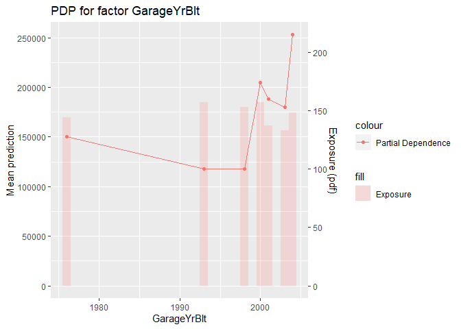

<!-- README.md is generated from README.Rmd. Please edit that file -->

codeBase
========

Introduction
============

What functions are included in the package?
-------------------------------------------

Currently the master branch contains the following functions however we
have many others as pull request

``` r
ls("package:codeBase")
#>  [1] "check_all_identical"            "create_html_pack"              
#>  [3] "encode_freq"                    "expl_categorical"              
#>  [5] "expl_na"                        "expl_summary"                  
#>  [7] "feature_importance_permutation" "hh_test"                       
#>  [9] "hh_train"                       "metric_confusion_matrix"       
#> [11] "metric_deviance"                "metric_F1"                     
#> [13] "metric_Fbeta"                   "metric_gini"                   
#> [15] "metric_mae"                     "metric_nloglik"                
#> [17] "metric_pode"                    "metric_pove"                   
#> [19] "metric_precision"               "metric_PrecisionRecall"        
#> [21] "metric_recall"                  "metric_rmse"                   
#> [23] "metric_ROC"                     "null_gini"                     
#> [25] "null_PrecisionRecall"           "null_ROC"                      
#> [27] "plot_2way_comparison"           "plot_ALE"                      
#> [29] "plot_feature"                   "plot_feature_predictions"      
#> [31] "plot_gini"                      "plot_lift_curve"               
#> [33] "plot_lift_curve_relative"       "plot_magic_carpet"             
#> [35] "plot_PDP"                       "plot_PrecisionRecall"          
#> [37] "plot_ROC"                       "plotting_numerical_buckets"    
#> [39] "prep_char_num_sort"             "prep_num_band"                 
#> [41] "prep_num_bin"                   "prep_numeric_caps"
```

Using the Package
=================

Import ‘Predicting Household Sale Prices’ dataset
-------------------------------------------------

Importing the packages inbuilt testing datasets

``` r
data(hh_train)
data(hh_test)
```

This data is the Californian house prices dataset and has a target of
SalePrice

Data Exploration
----------------

### expl\_na

For each variable, find the number or percentage of NA’s in a dataset

``` r
na_vars <- codeBase::expl_na(df = hh_train, na.strings = NULL, ignore.case = FALSE) 
```

We can now see that we have some factors which are useless as they are
mostly unknown:

``` r
head(dplyr::arrange(na_vars, -na)) %>% kable()
```

| var         |   na |     perc |
|:------------|-----:|---------:|
| PoolQC      | 1453 | 99.52055 |
| MiscFeature | 1406 | 96.30137 |
| Alley       | 1369 | 93.76712 |
| Fence       | 1179 | 80.75342 |
| FireplaceQu |  690 | 47.26027 |
| LotFrontage |  259 | 17.73973 |

### expl\_categorical

For each categorical variable, find the number of / percentage of each
level

``` r
codeBase::expl_categorical(df = hh_train, char.level = 3, num.level =2)  %>% kable()
```

| var        | level  | class     |    n |       perc |
|:-----------|:-------|:----------|-----:|-----------:|
| Alley      | Grvl   | character |   50 |  3.4246575 |
| Alley      | Pave   | character |   41 |  2.8082192 |
| Alley      | NA     | character | 1369 | 93.7671233 |
| CentralAir | N      | character |   95 |  6.5068493 |
| CentralAir | Y      | character | 1365 | 93.4931507 |
| LandSlope  | Gtl    | character | 1382 | 94.6575342 |
| LandSlope  | Mod    | character |   65 |  4.4520548 |
| LandSlope  | Sev    | character |   13 |  0.8904110 |
| PavedDrive | N      | character |   90 |  6.1643836 |
| PavedDrive | P      | character |   30 |  2.0547945 |
| PavedDrive | Y      | character | 1340 | 91.7808219 |
| Street     | Grvl   | character |    6 |  0.4109589 |
| Street     | Pave   | character | 1454 | 99.5890411 |
| Utilities  | AllPub | character | 1459 | 99.9315068 |
| Utilities  | NoSeWa | character |    1 |  0.0684932 |

This format can be easily plotted to show factor distributions for each
factor (either in a loop or using ggplot2 facet functions)

### expl\_summary

Find the mean, standard deviation, length, and NA count of numeric and
integer variables, with the option to group by other variables

``` r
codeBase::expl_summary(hh_train, summarise_vars = "SalePrice", group_vars = "YrSold") %>% kable()
```

| YrSold |     mean |       sd |   n | na\_count |
|-------:|---------:|---------:|----:|----------:|
|   2006 | 182549.5 | 79426.84 | 314 |         0 |
|   2007 | 186063.2 | 85768.17 | 329 |         0 |
|   2008 | 177360.8 | 69735.61 | 304 |         0 |
|   2009 | 179432.1 | 80879.24 | 338 |         0 |
|   2010 | 177393.7 | 80451.28 | 175 |         0 |

### encode\_freq

Apply frequency encoding with the option to group the rarest levels

``` r
# Add some unknowns to show what it looks like
hh_train$Neighborhood[5:10] <- NA
```

From the below output we can see that the factor Neighborhood has more
levels than can usefully be modelled

``` r
hh_train %>% group_by(Neighborhood) %>% summarise(Volume = n()) %>% kable()
#> `summarise()` ungrouping output (override with `.groups` argument)
```

| Neighborhood | Volume |
|:-------------|-------:|
| Blmngtn      |     17 |
| Blueste      |      2 |
| BrDale       |     16 |
| BrkSide      |     57 |
| ClearCr      |     28 |
| CollgCr      |    150 |
| Crawfor      |     51 |
| Edwards      |    100 |
| Gilbert      |     79 |
| IDOTRR       |     37 |
| MeadowV      |     17 |
| Mitchel      |     48 |
| NAmes        |    225 |
| NoRidge      |     40 |
| NPkVill      |      9 |
| NridgHt      |     77 |
| NWAmes       |     72 |
| OldTown      |    112 |
| Sawyer       |     74 |
| SawyerW      |     59 |
| Somerst      |     85 |
| StoneBr      |     25 |
| SWISU        |     25 |
| Timber       |     38 |
| Veenker      |     11 |
| NA           |      6 |

We decide to frequency encode the factor

``` r
nhood_freq <- codeBase::encode_freq(data = hh_train$Neighborhood, 
                                n_levels = 5, 
                                min_level_count = NULL, 
                                unknown_levels = NULL,
                                unknown_treatment_method = 1)
```

which gives us with the transformed factor

``` r
hh_train$nhood_freq <- factor(x = nhood_freq$data, labels = nhood_freq$levels)
hh_train %>% group_by(nhood_freq) %>% summarise(Volume = n()) %>% kable()
#> `summarise()` ungrouping output (override with `.groups` argument)
```

| nhood\_freq | Volume |
|:------------|-------:|
| Unknown     |      6 |
| NAmes       |    225 |
| CollgCr     |    150 |
| OldTown     |    112 |
| Edwards     |    100 |
| Somerst     |     85 |
| Other       |    782 |

Build a Model
-------------

We build a model using standard R functions

``` r
hh_train %<>% mutate(GarageYrBlt = coalesce(GarageYrBlt, YearBuilt))
model_vars <- c('GarageYrBlt', 'nhood_freq', 'OverallCond', 'ExterCond', target)
hh_train %<>% select(all_of(model_vars))
model <- stats::glm(formula = 'SalePrice ~ .',
                   family = 'gaussian',
                   data = hh_train)
summary(model)
#> 
#> Call:
#> stats::glm(formula = "SalePrice ~ .", family = "gaussian", data = hh_train)
#> 
#> Deviance Residuals: 
#>     Min       1Q   Median       3Q      Max  
#> -149874   -41215    -9310    24283   533214  
#> 
#> Coefficients:
#>                     Estimate Std. Error t value Pr(>|t|)    
#> (Intercept)       -2.596e+06  1.740e+05 -14.918   <2e-16 ***
#> GarageYrBlt        1.429e+03  8.272e+01  17.278   <2e-16 ***
#> nhood_freqNAmes   -3.426e+04  2.755e+04  -1.244   0.2138    
#> nhood_freqCollgCr -2.898e+04  2.778e+04  -1.043   0.2971    
#> nhood_freqOldTown -3.282e+04  2.800e+04  -1.172   0.2414    
#> nhood_freqEdwards -4.614e+04  2.800e+04  -1.648   0.0996 .  
#> nhood_freqSomerst -1.090e+04  2.822e+04  -0.386   0.6995    
#> nhood_freqOther   -2.111e+03  2.729e+04  -0.077   0.9383    
#> OverallCond        4.563e+03  1.799e+03   2.537   0.0113 *  
#> ExterCondFa       -8.469e+04  4.153e+04  -2.039   0.0416 *  
#> ExterCondGd       -5.672e+04  3.920e+04  -1.447   0.1481    
#> ExterCondPo       -1.076e+05  7.813e+04  -1.377   0.1689    
#> ExterCondTA       -5.770e+04  3.915e+04  -1.474   0.1407    
#> ---
#> Signif. codes:  0 '***' 0.001 '**' 0.01 '*' 0.05 '.' 0.1 ' ' 1
#> 
#> (Dispersion parameter for gaussian family taken to be 4428088746)
#> 
#>     Null deviance: 9.2079e+12  on 1459  degrees of freedom
#> Residual deviance: 6.4074e+12  on 1447  degrees of freedom
#> AIC: 36587
#> 
#> Number of Fisher Scoring iterations: 2
hh_train$pred <- predict(object = model, newdata = hh_train)
```

Model Evaluation
----------------

### plot\_PDP

We can now plot PDP plots for any factor

``` r
codeBase::plot_PDP(data = hh_train,
               model = model,
               explain_col = 'GarageYrBlt',
               n_bins = 20,
               use_plotly = FALSE)
```

<!-- -->

### plot\_PDP for 2 factors

We can also plot pairs of factors

``` r
codeBase::plot_PDP(data = hh_train,
               model = model,
               explain_col = c('GarageYrBlt', 'OverallCond'),
               n_bins = 10,
               use_plotly = FALSE)
```

<!-- -->

Note: OverallCond: Rates the overall condition of the house 10 - Very
Excellent 1 - Very Poor

### plot\_ALE

We can now plot ALE plots for any factor

``` r
codeBase::plot_ALE(data = hh_train,
               model = model,
               explain_col = 'GarageYrBlt',
               n_bins = 20,
               use_plotly = FALSE)
```

<!-- -->

### plot\_lift\_curve

We can also plot useful global model outputs such as lift curves

``` r
codeBase::plot_lift_curve(actual = hh_train$SalePrice,
                      predicted = hh_train$pred,
                      use_plotly = FALSE)
```

<!-- -->

### plotly vs ggplot2

Some users may require plotly and others ggplot2 so all plots work with
both engines. This can be controlled with the `use_plotly` parameter of
the plotting functions.

Metrics
-------

We have many metrics all of which have the same construction of
arguments meaning they can be used by other functions or in loops

``` r
codeBase::metric_rmse(actual = hh_train$SalePrice, predicted = hh_train$pred)
#> [1] 66246.97
codeBase::metric_mae(actual = hh_train$SalePrice, predicted = hh_train$pred)
#> [1] 46343.42

codeBase::metric_deviance(actual = hh_train$SalePrice, predicted = hh_train$pred, family = "gaussian")
#> [1] 4388660559
codeBase::metric_nloglik(actual = hh_train$SalePrice, predicted = hh_train$pred, family = "gaussian")
#> [1] 12.54942
```
